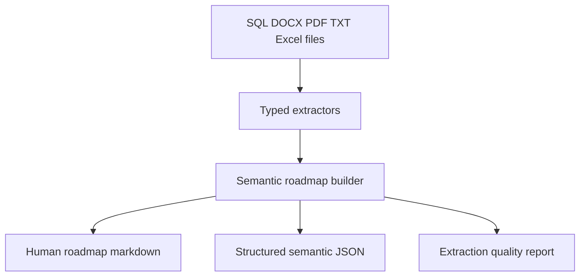

# RollsMary Semantic Roadmap Builder

Semantic extraction pipeline for turning legacy system files into a readable roadmap and structured knowledge base.


## Overview

This project recursively scans `data/` and extracts a system roadmap from SQL, DOCX, PDF, TXT, and Excel-style source files. It parses database objects, API contracts, workflow documents, and source evidence into structured markdown and JSON outputs that are easy to inspect, test, and extend.

## Key Features

- 🧭 Generates a readable RollsMary system roadmap
- 🧩 Extracts API endpoints, request parameters, response fields, and status rules
- 🗃️ Extracts SQL tables, columns, primary keys, indexes, descriptions, stored procedure parameters, selected fields, and referenced tables
- 🔁 Extracts the IVR action verification workflow from PDF text
- 🧠 Exports structured semantic nodes and validated relationships as JSON
- 📋 Writes an extraction quality report with coverage counts
- ✅ Keeps raw source files isolated under `data/` for repeatable tests

## Tech Stack

| Layer | Tool |
| --- | --- |
| Runtime | Python 3.11+ |
| Package manager | uv |
| Validation | Pydantic 2 |
| PDF parsing | pypdf |
| SQL parsing | regex extraction + sqlglot AST fallback |
| Excel parsing | openpyxl |
| Tests | pytest |

## Architecture



## Quick Start

Clone and enter the project:

```powershell
git clone https://github.com/RaheesAhmed/semantic-roadmap.git
cd semantic-roadmap
```

Install dependencies:

```powershell
uv sync
```

Run the extractor:

```powershell
uv run semantic-roadmap
```

Run tests:

```powershell
uv run pytest
```

Generated files:

```text
outputs/rollsmary-roadmap.md
outputs/rollsmary-knowledge-base.json
outputs/extraction-quality-report.md
```

## Project Structure

```text
data/
  CRM.Db/                                  # SQL database project
  RollsMaryAPI_ForCisco_V1_7.docx          # Cisco to RollsMary API contract
  Visio-IVR_Action_Verification_Flow.pdf   # IVR workflow sample
src/
  semantic_roadmap/
    cli.py                                 # command line entrypoint
    extractors/
      api/                                 # DOCX API contract extraction
      documents/                           # DOCX and PDF text extraction
      spreadsheets/                        # Excel workbook extraction
      sql/                                 # SQL inventory and semantic extraction
      workflows/                           # IVR workflow extraction
    inventory/                             # recursive data source discovery
    io/                                    # output writers
    roadmap/                               # semantic graph models and builders
tests/
  extractors/                              # extractor-level tests
  inventory/                               # source discovery tests
  roadmap/                                 # final roadmap tests
```

## API Documentation

This project exposes a local CLI:

| Command | Purpose |
| --- | --- |
| `uv run semantic-roadmap` | Build roadmap, JSON, and quality report from `data/` |
| `uv run semantic-roadmap --data-folder data` | Recursively read supported files under a data folder |
| `uv run semantic-roadmap --output outputs/demo` | Write generated files to another folder |
| `uv run semantic-roadmap --crm-db data/CRM.Db --api-docx data/RollsMaryAPI_ForCisco_V1_7.docx --ivr-pdf data/Visio-IVR_Action_Verification_Flow.pdf` | Run with explicit source files |

## Deployment

Run this locally with uv. Place source files under `data/`, run `uv run semantic-roadmap`, and review the generated files under `outputs/`.

## License

Private utility by Rahees Ahmed.
